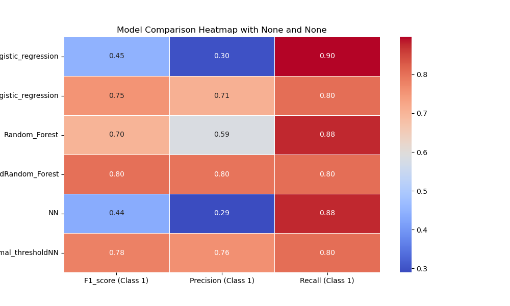

# Project Overview:   
   
   - This Project focuses on building a Fraud Detection using highly unbalanced Dataset from Kaggle using different machine learning models and choose the one with the highest F1 score for positive Class(fraud)
   - Using Logistic Regression ,RandomForest and Neural Networks with preprocessing on Training Dataset and hyperparameters Tunning 
# Key Challenges:
   
   - #### **Extreme Class imbalanced**: Dataset has Few Fraud Transaction (1<<%)
   - #### **Features Anonymous: High dimension Features and can't use domain knowledge for feature engineering or selection
   - #### **Model Overfitting: Try to ensure that the model generalize well on unseen data
   
# Dependencies:
    
   - Install Miniconda/Conda
   
        - Download and install Miniconda (lightweight) or Anaconda (full bundle)
   - Clone this repository

             git clone https://github.com/SherineTarek224/Credit_Card_Fraud_Detection.git
             cd Fraud_Detection
   - conda create environment

             conda activate Fraud 
   - Verify Installation
  
               conda list

# Repo Structure:

 Fraud_Detection/

     ├── Dataset/
     │    ├── train.zip
     │    ├── val.zip
     │    ├── test.zip
     │    └── trainval.zip
     ├── Imagegs/
         ├── SMOTE(0.05)
         ├── Under_Sampling(0.05)
     ├── .gitignore
     ├── data_helper.py
     ├── evaluation.py
     ├── Models_Comparison.py
     ├── Test_chosen_model.py
     ├── train_model.py
     ├── fraud_eda.ipynb
     ├── environment.yml
     └── README.md
  - README.md:Contains information about this project and important details
  - environment.yml:contain configuration of conda environment and library names and its version
  - EDA:Data analysis using jupyter notebook to explore features of dataset
  - data_helper:load_data ,detect_outliers,choose the preprocessor(MinMax,Std,Robust)and balancing_data using(SMOTE,Under_Sampling)
  - train_model:raining different models and evaluate them 
  - evaluation:evaluate models with different metrics(Recall,Percision,Recall ,AUC)
  - Models_Comparison:Compare models according different metrics and export heatmap comparison
  - Test_Chosen_Models:after save models.pkl now can choose which one of them to test them on unseen data 

# Models_Implemented:

 - [1] Logistic Regression:
     -  A simple and easy  model.
     - Tuned using L2 regularization.
     - Hyperparameter tuning performed using Grid Search.
     - Handles class imbalance via weighted class adjustments.
     
       
 - [2] Random_Forest:
     
     - An ensemble-based model.
     - Tuned using:
   
       - Number of trees (n_estimators)
       
       - Maximum tree depth (max_depth)
       
     - Class weights to handle imbalance.
    
     - RandomizedSearchCV was used to Tune hyperparameters.  

- [2] Neural_Nets:
   - A Simple Neural Nets Structure
   - 2 hidden_layer_sizes
   - Used activation Function for none_linear transformation  
   -  Randomized_SearchCV was used to Tune hyperparameters
# Results:

- Models_Performance Comparison (SMOTE(0.05) and optimal_threshold and its f1_score calculated on **Validation_Data_only**)

- SMOTE(0.05)
    

  
  

- UnderSampling(0.05)
    

  
  

